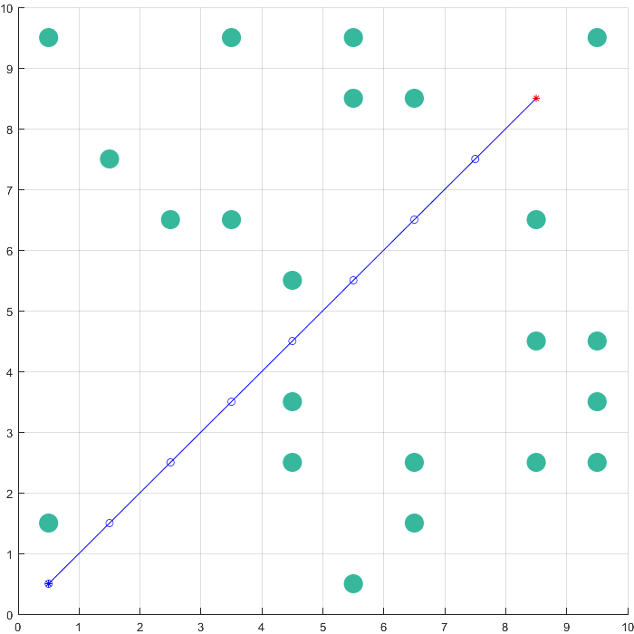
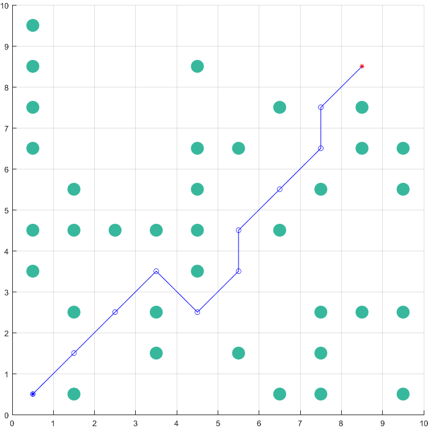
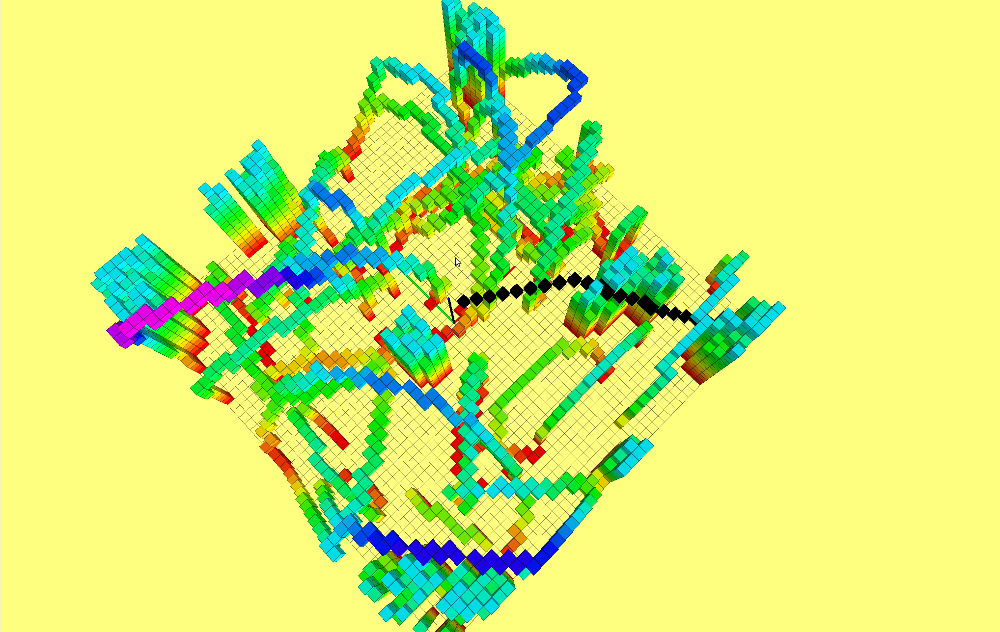
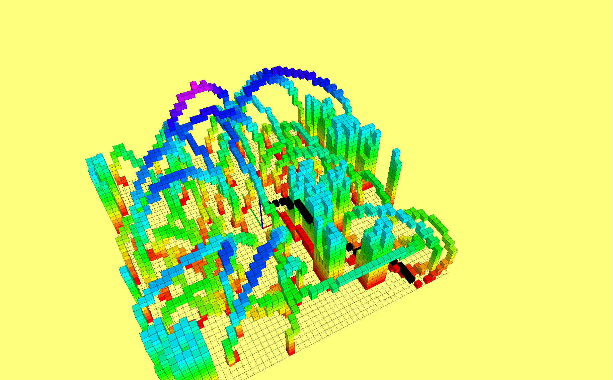
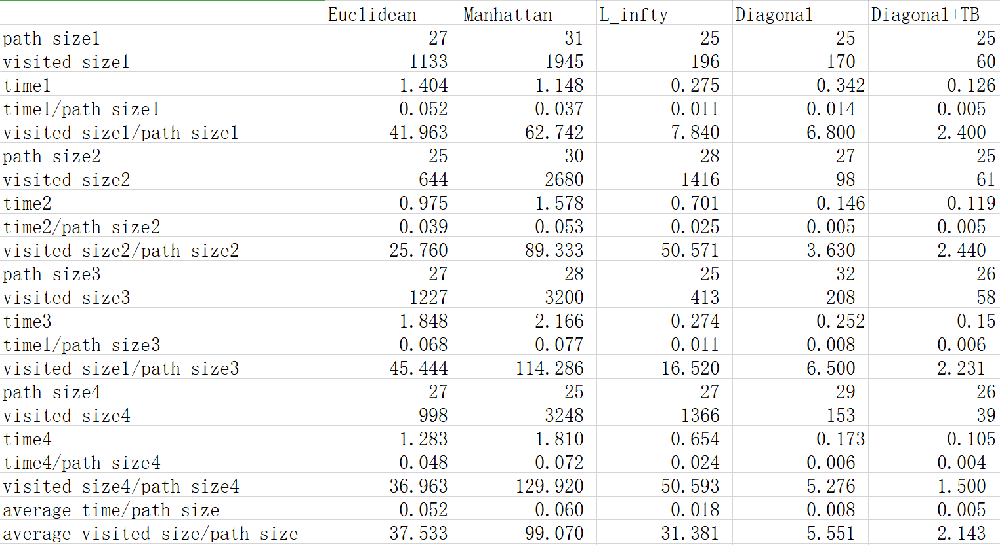

# 第二章作业

本次作业主要是在Matlab和ROS环境下完成了A^*^ 算法，并进行了相应的测试

## Matlab

matlab版本主要用于理解算法流程，由于matlab不支持大多数数据结构，只能用矩阵来模拟，故在matlab上只完成了基本的算法流程，所有实验和其他优化均在ROS版本下完成，此处只提供部分matlab运行结果的截图，用于验证算法的正确性。

obstacle_ratio = 0.25

obstacle_ratio = 0.35

  obstacle_ratio = 0.45

## C++/ROS

本次作业的重点均在CPP环境下完成，首先在使用最基础的欧几里得距离以及使用Tie\_breaker的情况下对代码的正确性进行了测试

  A*

  A* and JPS

接下来，对于每一种距离范数以及是否使用Tie\_breaker情况下的A*算法进行测试：测试方法具体为对每一种情况在四张随机地图中使用相同的目标点，计算单位路径长度下的搜索时间和访问点数，对其取平均作为算法的评价指标，结果如下:

从图上可以看出在栅格地图中diaginal距离是最为合适的选择，同时使用TB可以显著减少搜索过程中遍历的节点数目并降低运行时间

## A*和JPS比较

通常情况下，JPS要比A*工作的更好，尤其是在复杂环境下可以显著的减少遍历点的数目，但是在开阔的环境下，由于JPS的跳跃方式，会浪费大量资源在搜索无效的方向。

