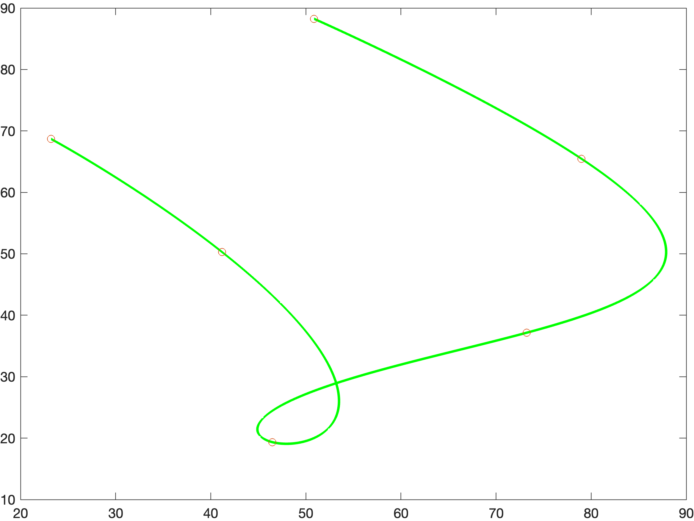
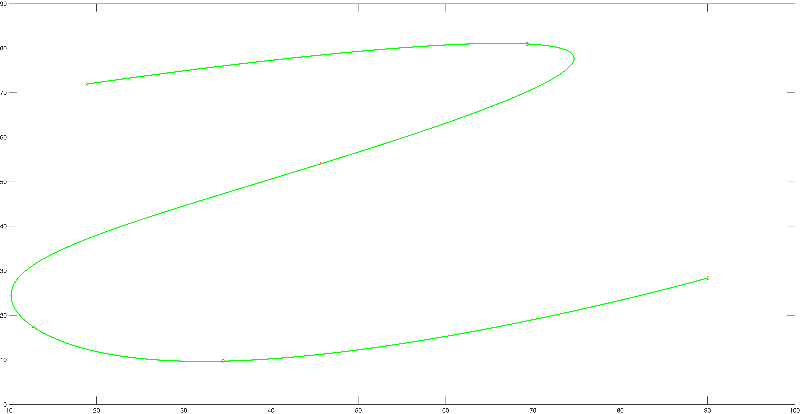

# 第五章作业

本次作业主要是在 matlab 和 ros 上完成了 minisnap 的数值求解和闭式解析求解过程

## Matlab-数值解

数值解法的主要难度在于构建 Q 矩阵和约束矩阵和向量 Abeq，本次作业中采用的约束构建顺序为起点状态-终点状态-中间点位置-中间点连续

## Matlab-闭式解析解

解析解的主要难度在于选择矩阵 C 和求解向量 d 的构造，本次作业使 用了参考中提供的首端状态-中端位置-末端状态-中端三阶状态导数的结构进行构建，求解和还原多项式系数

## ROS-闭式解析解

代码与 matlab 版本类似，只是需要分别对三轴求解

## ROS-数值解

使用了 osqp-eigen 求解器对构建的优化和约束方程进行求解, 需要注意以下几点

* [osqp](https://osqp.org/docs/get_started/sources.html) 必须先安装osqp
* [osqp-eigen](https://github.com/robotology/osqp-eigen.git) 之后在前一步基础上安装eigen外壳
* cmake 版本必须大于 3.8 才可以编译运行
* osqp-eigen 由于一些封装问题，导致使用时必须保证求解器实例的全生命周期存在，否则会导致内存错误，很坑，找了一下午才找到这个问题，官方 github 目前也只是建议手动确保实例的生命周期。

## 总结

本次作业代码涉及到大量的矩阵赋值参数，需要对矩阵的形状和对应的 参数有深刻的理解，尤其是对于 C 矩阵的赋值，需要关注求解变量的组织形式，并赋值正确，实现方法的关键点在代码中都做了逐行注释。

