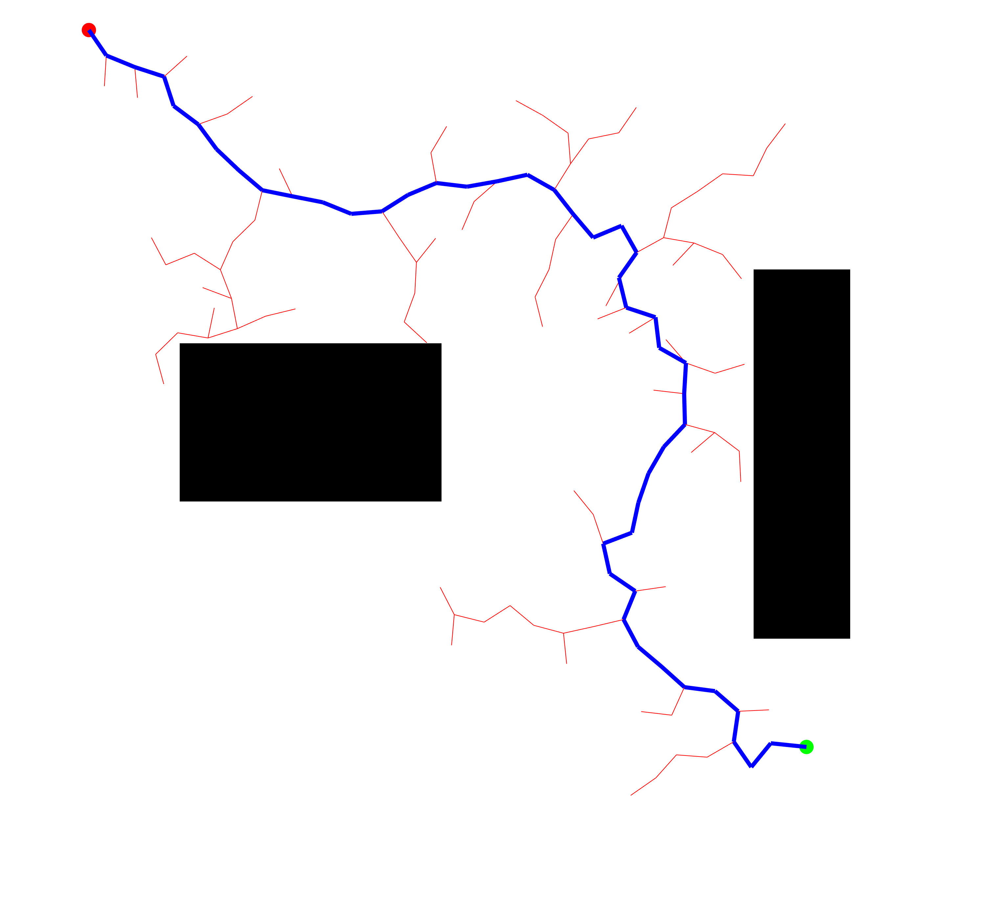
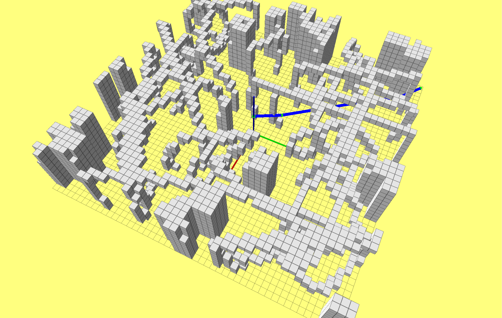
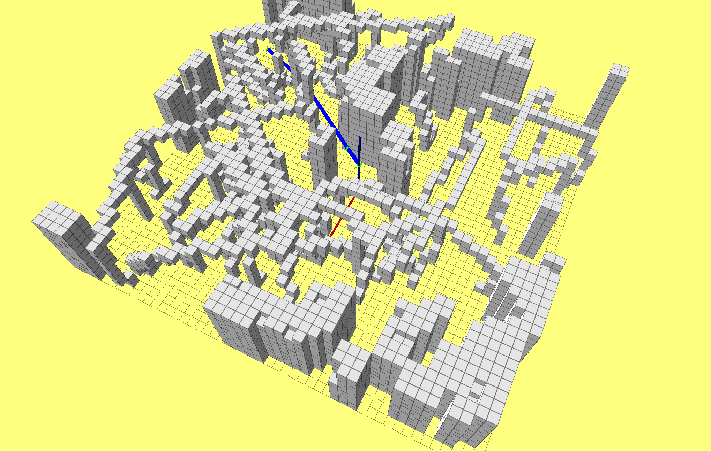

# 第三章作业

本次作业主要是在matlab和ROS环境下完成了RRT和RRT*算法，并进行了相应的测试

## Matlab

在matlab中基于给定的地图对RRT算法进行测试

相比于PRM方法，RRT将建图和搜索过程结合在了一起。RRT是概率完备但不是最优的。RRT需要在整个状态空间采样并且难以通过狭窄通道，效率不是非常高。

## C++/ROS

在ROS中基于ompl库实现了RRT*算法，并利用多张随机地图进行了测试

RRT*是RRT算法的改进版本，主要是增加了剪枝的过程，通过剪枝，RRT*是概率完备并且概率最优的，但是RRT*仍需要在整个状态空间内进行采样
