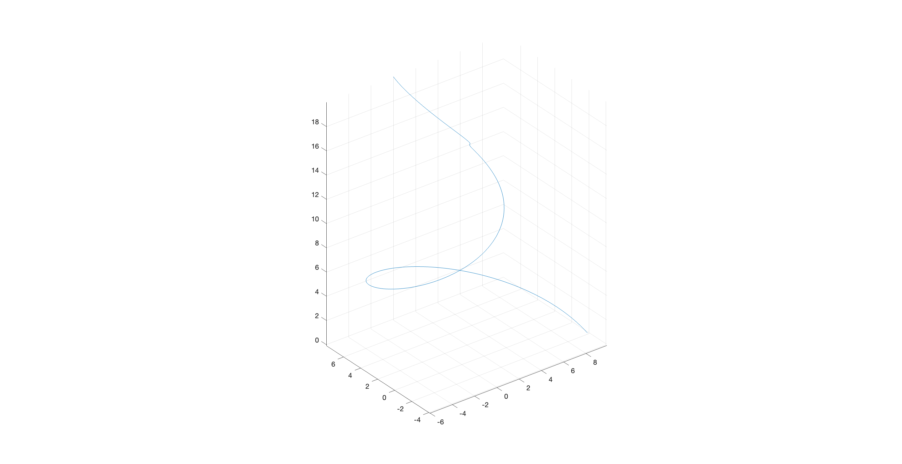
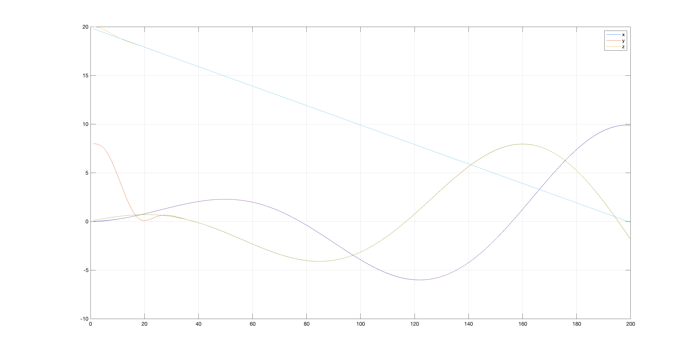
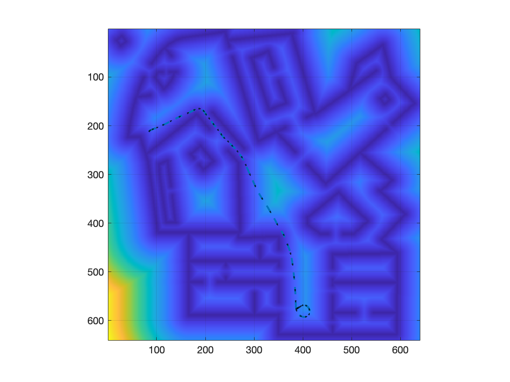
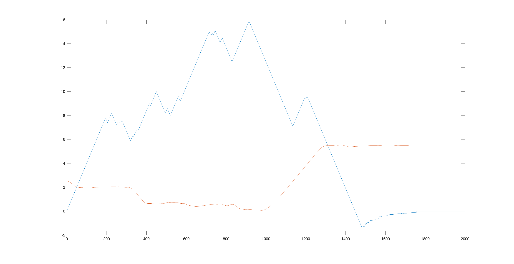

<!--
 * @Author: your name
 * @Date: 2021-05-08 21:18:42
 * @LastEditTime: 2021-05-08 22:41:24
 * @LastEditors: Please set LastEditors
 * @Description: In User Settings Edit
 * @FilePath: /Motion-plan/第八章：模型预测控制在运动规划的应用/README.md
-->
# 第八章作业

本次的作业主要是利用模型预测控制(MPC)来完成路径规划

## 无人机跟踪螺旋线模型

这个作业主要是完成基于线性二次规划优化的路径规划

## 无人车路径搜索模型

本次作业主要是完成基于粒子群优化的模型预测控制的路径规划

