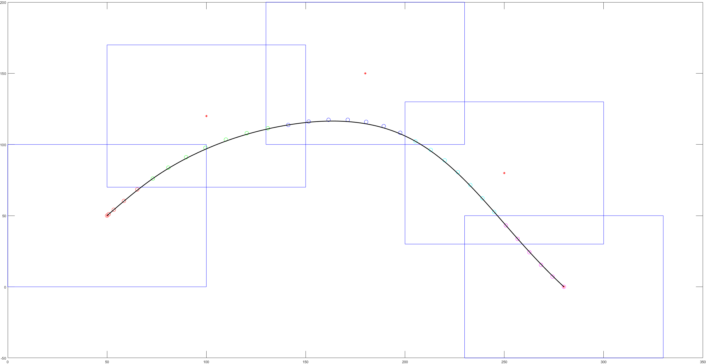
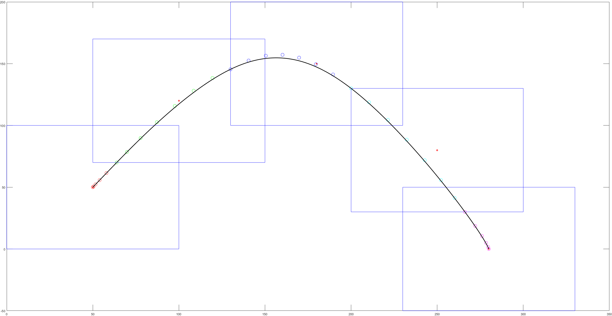

# 第六章作业

本次作业主要是完成了基于飞行走廊的硬约束的 minisnap 轨迹生成。 在作业中主要使用贝塞尔曲线作为选择的轨迹多项式，在完成作业的过程 中主要的 b 步骤如下:

* 获取 Q 矩阵以及贝塞尔曲线和普通多项式系数的对应关系矩阵 M
* 利用贝塞尔曲线必通过首尾控制点的特性构建等式约束
* 利用贝塞尔曲线的凸包性质不等式约束

作业结果的展示如下:

以上三图分别为时间 t=0.001，1，0.5 时的结果，可以看出 t 的分配对于生 成的轨迹有着重要的影响，但由于硬约束的存在，轨迹依然是安全且可以执 行的。